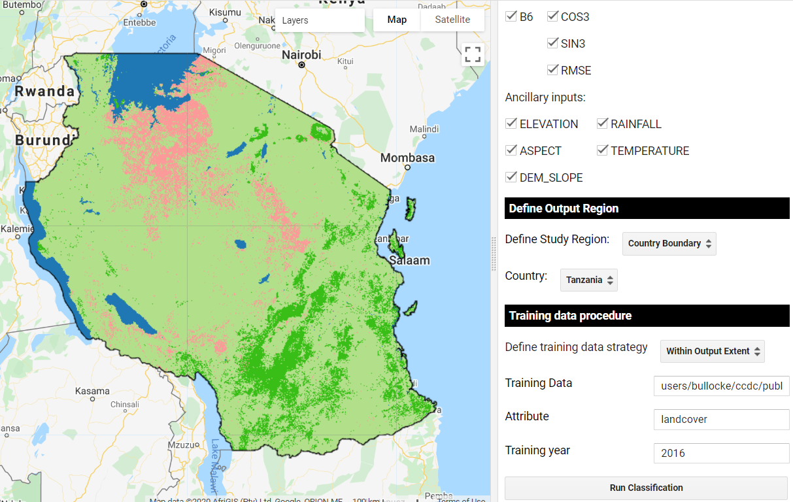
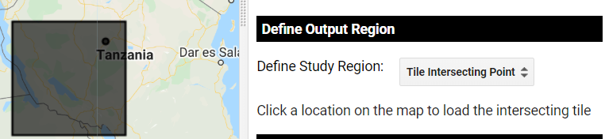
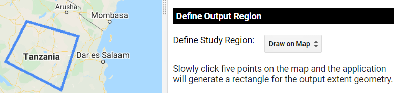
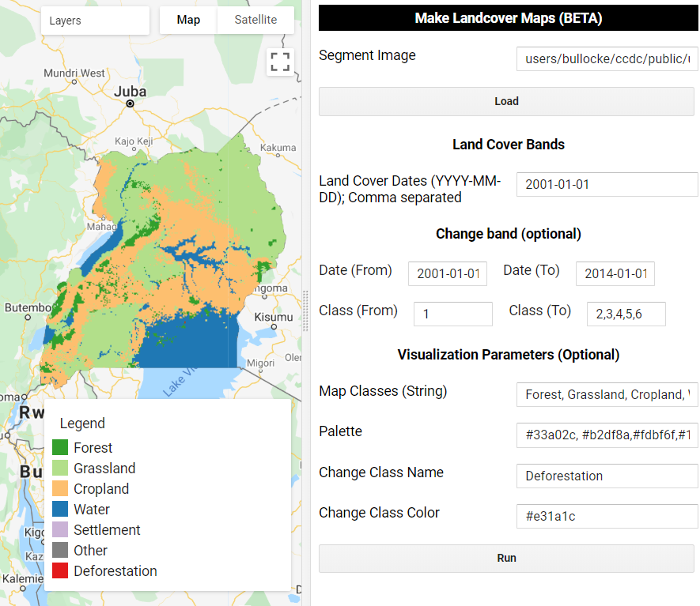
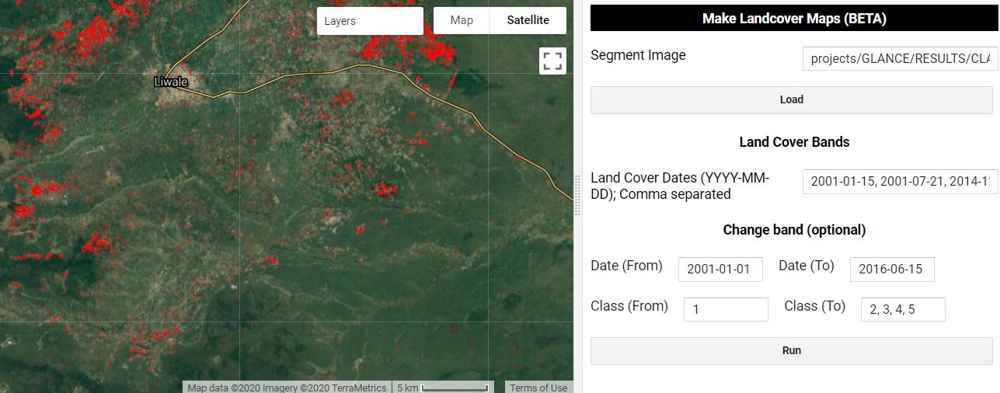

CCDC Classification Interface
-----------------------------

By Eric Bullock May 7, 2020

   Classification of CCDC model parameters for Uganda.

To faciliate easy access to our API we have created a series of graphical 
user interfaces (GUIs) that require no coding by the user. These guis can be
used for calculating CCDC model parameters (i.e. regression coefficients), 
displaying and interacting with CCDC coefficients and corresponding pixel 
time series, and classification of the model parameters. This tutorial will
demonstrate the gui for creating land cover and land cover change maps.

In this tutorial you will:

-  Classify CCDC segments based on their model parameters and ancillary
   data
-  Extract a land cover map for a specific date
-  Calculate land cover change between two or more dates

I provide example training data and CCDC coefficients for seven
countries in East Africa (Rwanda, Uganda, Ethiopia, Tanzania, Kenya,
Zambia, and Malawi). 

The first tool that be used in this tutorial can be found
`here <https://code.earthengine.google.com/?scriptPath=projects%2FGLANCE%3AAPPS%2Fclassify_app>`__.

1. Classify time series segments
--------------------------------

This first step is to classify the time series segments that are the
output from the CCDC algorithm. Users should refer to Zhu and Woodcock
(2014) for a detailed explanation of the CCDC algorithm. For a
refresher, however, the example belows shows the CCDC model fit for the
time series of one pixel. On the x-axis is time, and the y-axis is
reflectance. Each observation corresponds to a different image at that
same location. The parameters of the harmonic regression models, are
what we are classifying in this procedure. Thus, we are not classifying
Landsat observations, but rather the temporally-continuous model
segments. It should be noted that these models are unique for each
pixel, and therefore have a unique start and end time depending on land
cover or condition change.

.. figure:: ../img/ccdcExample.png
   :alt: CCDC Example

   Example CCDC time series for a pixel that is deforested but later 
   return to secondary forest.

This result of part 1 of this tutorial  will be an image with bands
corresponding to the pixel’s nth land cover label for nbands. In other 
words, band 1 is the first segment’s classification, band 2 is the 
second, and so on. Theoretically, a pixel can have dozens of segments. 
That is very rare, however, since the changes correspond to land change
occuring within that pixel. Thus, to reduce computational intensity we
limit the number of segments that are classified in this application to
6 per pixel.

The first step is to load the app, you should see a panel like this
appear:

.. figure:: ../img/classifyApp1.png
   :alt: app load screen

   The first step in the app is to load the coefficients.

These first few parameters describe the format of the CCDC results.
First, are they saved as a single image or a collection? Next is the path to
the CCDC results. In this example, we provide an example of an
ImageCollection of results with the path ‘projects/LCMS/SERVIR_CCDC’.
Finally, you must specify the date format that the results were run
with. For the example dataset they are in the format of ordinal years
(0). Click Load.

.. figure:: ../img/classifyApp2.png
   :alt: app second parameters

   Next comes parameter specification. 

Next are the parameters of the machine learning classifier and predictor
variables. Uncheck any bands, coefficients, or ancillary data that you
do not wish to be used as inputs to classification. The terrain inputs
are from the `30m SRTM global
DEM <https://doi.org/10.1029/2005RG000183>`__, while the climate inputs
are from the `WorldClim BIO Variables
V1 <https://doi.org/10.1002/joc.1276>`__.

The next option lets you decide how to define the region to classify and
export. As you’ll see, there are many options. Most of them revolve
around a global grid that we have created for the Global Land Cover
Mapping and Estimation (GLanCE) project. More information on the GLanCE
grid grid can be found on the `project
website <http://sites.bu.edu/measures/>`__.

.. figure:: ../img/glance_grids.png
   :alt: app third parameters

   The global GLanCE grid. 

There are four ways you can specify a tile to run in addition to
manually defining the study region or selecting a country. The simplest
option is to choose “Tile Intersecting Point”, and then click somewhere
on the map. You will see the grid overlapping the location you selected
loaded as the study region.

   Define study region from the global grid. 

Alternatively, you can manually define the study region by clicking on
five points on the map that define the borders.

   Manually define study region. 

The other options are to manually define output grids based on their
tile IDs, drawing on the map to specify multiple grids, or selecting a
country. If multiple grids are selected then each grid will be submitted
as a seperate task. If a country is selected then the entire country
boundary will be the study region.

.. figure:: ../img/classifyApp6.png
   :alt: app region 1

   Or an entire country!

The final set of parameters relate to the training data. An example
training dataset is provided as a FeatureCollection for the seven
countries noted above. The training data requires that each point has an
attribute identifying the land cover label, and must also correspond to
a specific year for training. You have the option to use the entire
FeatureCollection or only the points that fall within the study region.

   Classification of the first CCDC segment. 

Note, the classification runs quicker if the predictor data for each training 
point is saved in the feature's properties (as opposed to being calculated
on the fly. I recommend doing this process in a seperate task, and then using
the data with the predictors attached to quickly try classification parameters. 
You should see in the Console a note about whether or not the predictor
data must be sampled as the training points. If so, you can also submit
a task that will save this calculation for future use. 

Finally, when you click ‘Run Classification’, the classification
corresponding to the first segment period gets displayed on the map. In
this case, the models correspond to ~1999. The full classification stack
can be exported as a task that should appear with the description
“classification_segments”.

2. Create Land Cover and Land Cover Change Maps
-----------------------------------------------

Once the task has completed processing, we can use it to make landcover
maps at any date in time for the study region. This asset can be used
directly in the `Landcover
Application <https://code.earthengine.google.com/?scriptPath=projects%2FGLANCE%3AAPPS%2Flandcover_app>`__.
This application is relatively simple - all you need to do is specify
the path to the segment image created above and a list of dates and
voilà! The dates should be entered in the format ‘YYYY-MM-DD’ and
seperated by commas, for example “2001-01-15, 2001-07-21, 2014-12-10”.
Each band in the output image will correspond to a different date’s
classification.

   Land cover classification for 2001-01-01. 

This app also has the function to add a change between that represents
conversion from one or multiple classes at a specified date to a
specified class or group of classes. You must first specify the starting
and ending dates and the land cover class # labels for the corresponding
dates. For example, the following examples shows the pixels (red) that
are class 1 (forest) in 2001-01-01, and are either class 2, 3, 4, or 5
in 2014-01-15. In other words, deforestation from January 2001 to June
2016. You can also specify a single value for the Class (To) box, for
example just using 3 would map conversion from 1 to 3, or forest to
cropland. If these boxes are left empty then just the land cover maps
will be created.

Finally, the tool allows you to specify some visualization parameters.
This step is very straightforward, just list the land cover names
and corresponding numeric value, and optionally provide a palette.

   Land cover in 2001 and deforestation between 2001 and 2014. 
