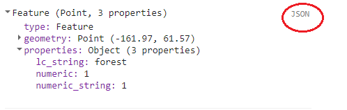
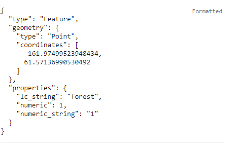

Part 2: Prepare training data
-----------------------------

The second step in performing land cover analysis using CCDC is
collecting training data. There are a few requirements for the training
data for it to work with the rest of the process. This tutorial
demonstrates how to ensure your data meets these requirements.

Training data requirements:
~~~~~~~~~~~~~~~~~~~~~~~~~~~

-  The data must be an Earth Engine FeatureCollection of point
   geometries.
-  An attribute in each point must contain a numeric value indicating
   the associated land cover.
-  An attribute in each point must contain a year that corresponds to
   the land cover label.

Optional additional steps
~~~~~~~~~~~~~~~~~~~~~~~~~

-  The predictor data as attributes for each point and for the year that
   corresponds to the land cover label.
-  Unique sample IDs as attributes

Importing your training data as an Earth Engine Asset
~~~~~~~~~~~~~~~~~~~~~~~~~~~~~~~~~~~~~~~~~~~~~~~~~~~~~

I am not going to go into details, as that has been documented in depth
on `Google's Developer
Page <https://developers.google.com/earth-engine/importing>`__. However,
it's worth making sure your data is the correct format. You can do that
by printing out the first feature. Note that in this tutorial, all
capitalized text in code blocks indicate paths that assets that you
should replace with your own corresponding path.

.. code:: javascript

    var trainingPath = 'PATH/TO/YOUR/TRAININGDATA'
    var trainingData = ee.FeatureCollection(trainingPath)
    print(trainingData.first())

In the console, you should see information on the first training point.
Select the feature and then select 'geometry'. Make sure the the 'type'
is 'Point', like in the figure below. If it is anything else (such as
Rectangle or Polygon) then your must convert your data to points before
continuing.

Creating a numeric land cover attribute
~~~~~~~~~~~~~~~~~~~~~~~~~~~~~~~~~~~~~~~

The land cover label must be numeric, so it cannot be a string (such as
"forest") or a numeric string (or a number that is written in string
format). To check the type of your attribute select the 'JSON' button on
the right side of the console to expand the json representation of the
feature. The button is circled in red below:

   img1
You should see the JSON of the feature appear:

   img2
Note that my feature has three attributes: lc\_string, numeric, and
numeric\_string. The lc\_string attribute will not work because the
classifiers require numeric class property. In the first picture, where
the output is formatted, the numeric and numeric\_string both look like
they'd work. But when viewing the JSON representation, it can be seen
that the numeric\_string still has quotations, and thus is still
formatted as a string. Therefore, only the numeric attribute would work
for this tutorial.

If you do not have a numeric attribute indicating land cover you can
convert a string attribute to numeric using the 'remap' Earth Engine
(EE) function. The code to do so is rather straightforward, but we have
a helper function in our API. For this example, I'll demonstrate how
it's done using the EE function and our CCDC API, and hereforth I'll
mostly be relying on the API.

In pure EE code, and using the class attribute name in the above example
and assuming our only classes are 'forest','agriculture',and 'water',
you can convert them to numeric values in a new attribute 'landcover'
with the following code:

.. code:: javascript

     trainingData  = trainingData.map(function(feat) {
       return feat.set('landcover',feat.get('lc_string'))})
       .remap(['forest','agriculture','water'],[1,2,3],'landcover')

This can also be done using the 'remapLC' function in our API. See API
documentation for a full description of available functions (todo).

.. code:: javascript

    // First load the API file
    var utils = require('projects/GLANCE:ccdcUtilities/api')

    trainingData = utils.Classification.remapLC(
      fakeFC, 'lc_string', 'landcover',['forest','agriculture','water'],[1,2,3])

    print(trainingData.first())

Note that there should now be an attribute called 'landcover' that is
numeric.

Add a year attribute
~~~~~~~~~~~~~~~~~~~~

In order to determine the CCDC coefficients to use as predictors for
training the classifier, each point needs to have a year attribute to
query the CCDC results by. For example, if you know a training point
corresponds to forest in 2014, then the CCDC coefficients for 2014 will
be used for training. If all of your training data corresponds a certain
year, you can add the attribute with a simple bit of code. In this
example the training data corresponds to 2014 and it is assigned to an
attribute named 'year'. .

.. code:: javascript

     trainingData  = trainingData.map(function(feat) {
       return feat.set('year',2014)})

Your training data might have a 'start' and 'end' attribute, in which
case we have a function for calculating the middle date. In this
example, the start year attribute is 'Start\_Year', the end attribute is
'End\_Year', and the output attribute name is 'Middle\_Year'

.. code:: javascript

    trainingData = utils.Classification.getMiddleDate(trainingData, 'Start_Year','End_Year','Middle_Year')

Get predictor data for each training point
~~~~~~~~~~~~~~~~~~~~~~~~~~~~~~~~~~~~~~~~~~

This final step is not technically necessary as it can be done prior to
submitting the classification, but it allows for quicker a
classification that loads "on the fly". This is useful for testing
classification parameters. The function to do is called
'getTrainingCoefsAtDate'. First, however, we need to construct the CCDC
coefficient image to sample from.

.. code:: javascript

    // Define bands to use in classification
    var bands = ["BLUE","GREEN","RED","NIR","SWIR1","SWIR2", "TEMP"]

    // Define coefficients to use in classification
    var coefs = ["INTP", "SLP","COS", "SIN","RMSE","COS2","SIN2","COS3","SIN3"]

    // Segment ids
    var segs = ["S1", "S2", "S3", "S4", "S5", "S6","S7","S8","S9"]

    // CCDC change detection results from the first part of this tutorial.
    var ccdc = ee.Image('PATH/TO/CHANGERESULTS')

    // Fill no data values
    var ccdImage = utils.CCDC.newBuildCcdcImage(ccdc, segs.length, bands)

Now that we have the CCDC image we can ocalculate the predictor data for
each point, filter features that return no data, and export the results
as an asset.

.. code:: javascript

    var trainingData = utils.Classification.getTrainingCoefsAtDate(
      trainingData, coefs, bands, 'Middle_Year', null, ccdImage, segs)
    var trainingDate = trainingData.filter(ee.Filter.notNull(['BLUE_COS']))

    print(trainingData.first())

    Export.table.toAsset({
      collection: trainingData,
      description: 'trainingDataProcessed',
      assetId: 'PATH/TO/NEW/ASSET'})

You should now see in the feature attributes all of the predictor data
that can be used for classification.

Add unique IDs as attributes
~~~~~~~~~~~~~~~~~~~~~~~~~~~~

Another optional, but recommended, step is assigning each sample with a
unique ID as an attribute. EE gives each point an ID, but they can be
long and seemingly random. The 'assignIDs' function in our API will
shuffle the sample and assign a unique ID to a given attribute name.

.. code:: javascript

    trainingData = utils.Classification.assignIds(trainingData, 'ID')
